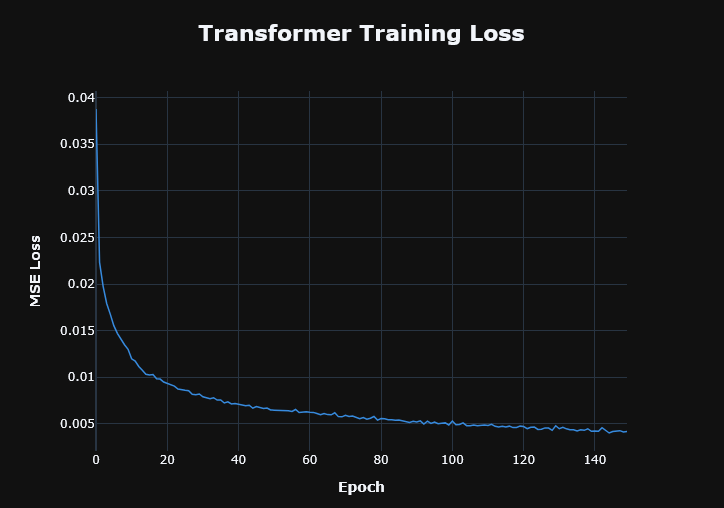
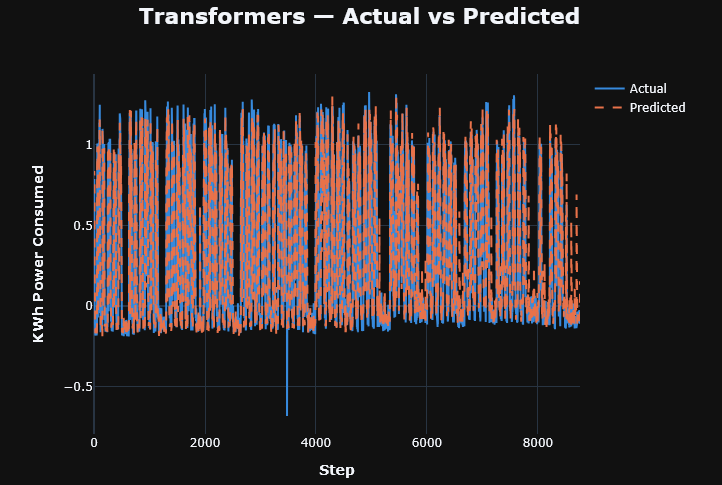
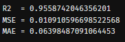

# Sequence Models from Scratch in JAX

> Built RNN → LSTM → GRU → Transformer by hand to understand what sequence models actually compute — no high-level frameworks, no black boxes, every weight matrix explicit. The key insight that clicked along the way: **it's all `einsum`. Every gate, every attention head, every projection is just a named tensor contraction.**

No Flax. No Haiku. No parameter registries. Plain JAX arrays in a `NamedTuple`, `lax.scan` for sequences, `vmap` for batches.

---

## The Learning Journey

| Notebook | Architecture | Training |
|---|---|---|
| 01–02 | RNN, LSTM | Python `for` loop |
| 03–04 | RNN, LSTM | Refactored into functional style |
| 05–06 | GRU | `lax.scan` for sequence unrolling |
| 07 | GRU | Fully XLA-compiled — `vmap` + nested `lax.scan` |
| **08** | **Transformer** | **Multi-head attention end-to-end as `einsum`** |

Each step added one piece of understanding. By the time the Transformer landed, every operation — Q/K/V projections, attention scores, value aggregation, FFN — was already familiar as a tensor contraction with named axes.

---

## Transformer — the destination (`08-Transformer-Iron-Regr-Batch.py`)

**Task:** predict industrial power consumption (`Usage_kWh`) from 12 engineered features on the Korean Steel Industry dataset (~35k readings at 15-minute intervals).

**Config:** `d_model=32` · `n_heads=4` · `head_dim=8` · `ffn_out_1=128` · `timesteps=14` · `batch_size=32` · 150 epochs · AdamW `lr=1e-3`

### Every layer as `einsum`

**Input projection** — raw features → model space:
```python
einsum("tf, fb -> tb", X, Wi) + bi          # (timesteps, d_model)
```

**Sinusoidal positional encoding** — added to the projection before attention.

**Q, K, V projections** — one weight cube `(d_model, n_heads, head_dim)` per matrix:
```python
Q = einsum("td, dhk -> thk", X_proj, W_Q)  # same for K, V
```

**Scaled dot-product attention:**
```python
scores        = einsum("qhn, khn -> hqk", Q, K) / sqrt(head_dim)
weights       = softmax(scores, axis=-1)
weighted_sums = einsum("htk, khn -> thn", weights, V)
```

**Output projection** — collapse heads back to `d_model`:
```python
einsum("thn, nhd -> td", weighted_sums, Wo)
```

**Residual + LayerNorm** after attention, then again after FFN.

**FFN** — expand with GELU, contract back:
```python
h   = GELU( einsum("do, td -> to", W_ffn1, z) )
out = einsum("do, id -> io", W_ffn2, h) + b_ffn2
```

**Prediction** — last timestep only:
```python
y_pred = einsum("do, d -> o", W_final, X_proj[-1])
```

### Results

Training converges cleanly over 150 epochs:



Actual vs. predicted on the held-out test set (final 25% of the time series, never seen during training):



Regression metrics (R², MSE, MAE) on the test set:



---

## Shared Design Patterns

**`ModelWeights` as a `NamedTuple`** — JAX treats it as a pytree, so `jax.value_and_grad`, `optax.apply_updates`, and `optimizer.init` all work on the full weight tree with zero boilerplate.

**Sliding window via `vmap` + `lax.dynamic_slice`** — builds the full `(N-T, T, F)` input tensor without a Python loop:
```python
X_stack = jax.vmap(
    lambda i: jax.lax.dynamic_slice(X, (i, 0), (timesteps, F))
)(jnp.arange(N - timesteps))
```

**Training loop** — outer Python `for` over epochs, inner `lax.scan` over batches so the full batch pass is a single compiled XLA call:
```python
train_state, loss = jax.lax.scan(
    lambda carry, DS: train_step(carry.params, DS, PE, carry.opt_state),
    init=train_state,
    xs=(X_batch, y_batch),
)
```

---

## Feature Engineering (Korean Steel Dataset)

- **Log transforms** on `Usage_kWh` and `Lagging_Current_Reactive_Power_kVarh`
- **Power factor complement**: `1 - PF/100`
- **Cyclic time encoding**: sin/cos pairs for weekday (period 7), month (period 12), and time-of-day in minutes (period 1440) — 6 features, no ordinal assumptions
- **Scaling**: `RobustScaler` on `NSM` and `Usage_kWh`; `RobustScaler` without centering (20–80th percentile) on reactive power; `MaxAbsScaler` on CO2

---

## Setup

Requires [uv](https://docs.astral.sh/uv/). Install it if you don't have it:

```powershell
# Windows
powershell -ExecutionPolicy ByPass -c "irm https://astral.sh/uv/install.ps1 | iex"
```

```bash
# macOS / Linux
curl -LsSf https://astral.sh/uv/install.sh | sh
```

Then clone and sync:

```bash
git clone https://github.com/your-username/sequence-models-jax.git
cd sequence-models-jax

uv sync --upgrade --no-cache --all-groups
```

`uv sync` pins Python 3.14, creates the `.venv`, and installs all dependencies from `pyproject.toml`. `--upgrade` pulls the latest compatible versions, `--no-cache` ensures a clean install, `--all-groups` includes every dependency group.

---

## Running the Notebooks

All notebooks are [Marimo](https://marimo.io) apps (`.py` files, not `.ipynb`).

**Open the whole project** — launches a file browser where you can pick any notebook:

```bash
uv run marimo edit notebook/
```

**Or open a specific notebook directly:**

```bash
# Interactive — edit cells, re-run reactively
uv run marimo edit notebook/08-Transformer-Iron-Regr-Batch.py

# Read-only — run and view outputs only
uv run marimo run notebook/08-Transformer-Iron-Regr-Batch.py
```

> **Note:** data files use absolute Windows paths (`D:\Codebase\NN-Architectures\data\...`). Update the `url` variable in each notebook if running from a different location.

---

## Stack

| Component | Library |
|---|---|
| Array computation, autodiff, JIT | JAX |
| Optimizers | Optax |
| Notebook environment | Marimo ≥ 0.23.6 |
| Visualization | Plotly |
| Preprocessing | scikit-learn |
| Data | pandas, NumPy |
